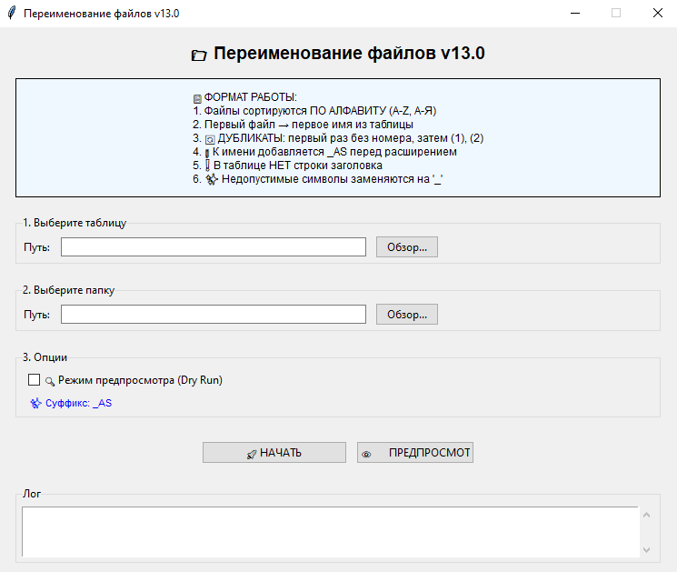

# 📁 File Renamer v13.0

[](https://www.python.org/downloads/)
[](LICENSE)
[](https://www.microsoft.com/windows)

Профессиональная программа для массового переименования файлов на основе таблицы Excel/CSV с графическим интерфейсом.



## ✨ Основные возможности

- 📋 **Переименование по таблице** - используйте Excel (.xlsx, .xls) или CSV файлы
- 📎 **Автоматический суффикс** - добавление `_AS` перед расширением файла
- 🔍 **Режим предпросмотра (Dry Run)** - проверка результата без изменения файлов
- 🔄 **Обработка дубликатов** - автоматическая нумерация `(1)`, `(2)`, `(3)`...
- ✨ **Санитизация имен** - автоматическая замена недопустимых символов
- 📊 **Детальное логирование** - полная история операций с ротацией логов
- 🎨 **Современный GUI** - интуитивно понятный интерфейс на Tkinter
- 🧵 **Многопоточность** - интерфейс не зависает при обработке

## 📋 Содержание

- [Установка](#-установка)
- [Быстрый старт](#-быстрый-старт)
- [Как это работает](#-как-это-работает)
- [Формат таблицы](#-формат-таблицы)
- [Примеры использования](#-примеры-использования)
- [Особенности](#-особенности)
- [Устранение неполадок](#-устранение-неполадок)
- [FAQ](#-faq)
- [Технические детали](#-технические-детали)
- [Лицензия](#-лицензия)

## 🚀 Установка

### Требования

- **Python 3.8+** ([скачать](https://www.python.org/downloads/))
- **Windows 7/8/10/11**

### Автоматическая установка (рекомендуется)

1. Скачайте [последний релиз](https://github.com/yourusername/file-renamer/releases)
2. Распакуйте архив
3. Запустите `УСТАНОВКА.bat` двойным кликом
4. Дождитесь сообщения "Установка завершена!"

### Ручная установка

```bash
# Клонировать репозиторий
git clone https://github.com/yourusername/file-renamer.git
cd file-renamer

# Установить зависимости
pip install -r requirements.txt
```

#### requirements.txt
```
pandas>=2.0.0
openpyxl>=3.1.0
```

## 🎯 Быстрый старт

### Windows (без командной строки)

**Первый запуск:**
1. Двойной клик на `УСТАНОВКА.bat`
2. Двойной клик на `renamer_gui_v13_unified.pyw` ⭐

**Последующие запуски:**
- Двойной клик на `renamer_gui_v13_unified.pyw`
- или `ПУСК.bat`
- или `Запуск.vbs`

### Командная строка

```bash
# Запуск без консоли (Windows)
pythonw renamer_gui_v13_unified.pyw

# Запуск с консолью (для отладки)
python renamer_gui_v13_unified.py
```

## 📖 Как это работает

### Схема работы

```
┌─────────────────┐      ┌──────────────────┐
│  Таблица Excel  │      │  Папка с файлами │
│                 │      │                  │
│  A1: video      │      │  1.mp4           │
│  A2: document   │  →   │  2.pdf           │
│  A3: video      │      │  3.jpg           │
│  A4: photo      │      │  4.png           │
└─────────────────┘      └──────────────────┘
         ↓                        ↓
         └────────────┬───────────┘
                      ↓
          ┌───────────────────────┐
          │   File Renamer v13    │
          │  Сортировка A-Z, А-Я  │
          │  Добавление _AS       │
          │  Нумерация дубликатов │
          └───────────────────────┘
                      ↓
          ┌───────────────────────┐
          │  Результат:           │
          │  1.mp4 → video_AS.mp4 │
          │  2.pdf → document_AS.pdf│
          │  3.jpg → video (1)_AS.jpg│
          │  4.png → photo_AS.png │
          └───────────────────────┘
```

### Алгоритм

1. **Загрузка таблицы** - чтение имен из первого столбца (без заголовка)
2. **Загрузка файлов** - сканирование папки и сортировка по алфавиту
3. **Сопоставление** - первый файл → первое имя, второй файл → второе имя
4. **Обработка дубликатов** - добавление номеров `(1)`, `(2)`...
5. **Добавление суффикса** - `_AS` перед расширением
6. **Переименование** - фактическое изменение имен файлов

## 📋 Формат таблицы

### ⚠️ ВАЖНО: В таблице НЕТ строки заголовка!

### Правильный формат

**Excel/CSV:**
```
┌────────────┐
│ video      │ ← A1 (первая строка - это данные!)
│ document   │ ← A2
│ video      │ ← A3
│ photo      │ ← A4
└────────────┘
```

### ❌ Неправильный формат

```
┌────────────┐
│ Имя файла  │ ← Заголовок (будет использован как имя!)
│ video      │
│ document   │
└────────────┘
```

### Поддерживаемые форматы

- **Excel:** `.xlsx`, `.xls`
- **CSV:** `.csv` (UTF-8)

### Особенности

- Используется **только первый столбец** (столбец A)
- Пустые строки автоматически **пропускаются**
- Пробелы в начале/конце **удаляются**
- Недопустимые символы **заменяются на** `_`

## 🎨 Примеры использования

### Пример 1: Простое переименование

**Таблица:**
```
presentation
report
summary
```

**Файлы в папке:**
```
1.pptx
2.docx
3.pdf
```

**Результат:**
```
✅ 1.pptx → presentation_AS.pptx
✅ 2.docx → report_AS.docx
✅ 3.pdf  → summary_AS.pdf
```

---

### Пример 2: С дубликатами

**Таблица:**
```
video
video
video
photo
```

**Файлы в папке:**
```
a.mp4
b.avi
c.mkv
d.jpg
```

**Результат:**
```
✅ a.mp4 → video_AS.mp4          (первое вхождение)
✅ b.avi → video (1)_AS.avi      (второе вхождение - дубликат)
✅ c.mkv → video (2)_AS.mkv      (третье вхождение - дубликат)
✅ d.jpg → photo_AS.jpg
```

---

### Пример 3: С пробелами и спецсимволами

**Таблица:**
```
My Video 2024
Report: Final
Test<>File
```

**Файлы в папке:**
```
file1.mp4
file2.pdf
file3.txt
```

**Результат:**
```
✅ file1.mp4 → My Video 2024_AS.mp4
✅ file2.pdf → Report_ Final_AS.pdf      (: заменено на _)
✅ file3.txt → Test__File_AS.txt         (<> заменены на _)
```

---

### Пример 4: Больше имен, чем файлов

**Таблица:**
```
video
document
photo
audio
subtitle
```

**Файлы в папке:**
```
1.mp4
2.pdf
3.jpg
```

**Результат:**
```
✅ 1.mp4 → video_AS.mp4
✅ 2.pdf → document_AS.pdf
✅ 3.jpg → photo_AS.jpg
⏹️ Имена "audio" и "subtitle" не использованы
```

---

### Пример 5: Больше файлов, чем имен

**Таблица:**
```
video
document
```

**Файлы в папке:**
```
1.mp4
2.pdf
3.jpg
4.png
```

**Результат:**
```
✅ 1.mp4 → video_AS.mp4
✅ 2.pdf → document_AS.pdf
⏹️ 3.jpg → не переименован (нет имени)
⏹️ 4.png → не переименован (нет имени)
```

## 🔧 Особенности

### 📎 Суффикс _AS

Все файлы автоматически получают суффикс `_AS` **перед расширением**:

```python
# Формула:
новое_имя = базовое_имя + "_AS" + расширение

# Примеры:
"video" + "_AS" + ".mp4"     → "video_AS.mp4"
"doc (1)" + "_AS" + ".pdf"   → "doc (1)_AS.pdf"
```

**Зачем это нужно:**
- ✅ Отличать переименованные файлы от оригинальных
- ✅ Расширение остается в конце (Windows правильно определяет тип)
- ✅ Можно легко найти все обработанные файлы

**Как изменить суффикс:**
```python
# В файле renamer_gui_v13_unified.py найдите:
CONFIG = {
    'file_suffix': '_AS',  # ← Измените на свой
}

# Примеры:
'file_suffix': '_renamed'   # → video_renamed.mp4
'file_suffix': '_new'       # → video_new.mp4
'file_suffix': ''           # → video.mp4 (без суффикса)
```

---

### 🔄 Обработка дубликатов

Если в таблице есть повторяющиеся имена:

```
Таблица:        Результат:
video       →   video_AS.mp4
video       →   video (1)_AS.avi
video       →   video (2)_AS.mkv
document    →   document_AS.pdf
document    →   document (1)_AS.docx
```

**Логика нумерации:**
- Первое вхождение: без номера
- Второе вхождение: `(1)`
- Третье вхождение: `(2)`
- И так далее...

---

### ✨ Санитизация имен файлов

Недопустимые символы Windows автоматически заменяются на `_`:

| Символ | Замена | Пример |
|--------|--------|--------|
| `<` | `_` | `Test<File` → `Test_File` |
| `>` | `_` | `Test>File` → `Test_File` |
| `:` | `_` | `Test:File` → `Test_File` |
| `"` | `_` | `Test"File` → `Test_File` |
| `/` | `_` | `Test/File` → `Test_File` |
| `\` | `_` | `Test\File` → `Test_File` |
| `|` | `_` | `Test|File` → `Test_File` |
| `?` | `_` | `Test?File` → `Test_File` |
| `*` | `_` | `Test*File` → `Test_File` |

---

### 🔍 Режим предпросмотра (Dry Run)

**Что это:**
- Показывает результат **без фактического** переименования
- Безопасная проверка перед изменением файлов

**Как использовать:**
1. Поставьте галочку "Режим предпросмотра (Dry Run)"
2. Нажмите "НАЧАТЬ"
3. Изучите лог - что будет переименовано
4. Снимите галочку для реального переименования

**Пример лога:**
```
[DRY] [1] 1.mp4 → video_AS.mp4
[DRY] [2] 2.pdf → document_AS.pdf
[DRY] [3] 3.jpg → video (1)_AS.jpg

🔍 ПРЕДПРОСМОТР - файлы не были изменены
```

---

### 📊 Логирование

**Где хранятся логи:**
- В окне программы (кнопки: Копировать, Экспорт, Очистить)
- В файле `file_renamer.log` (автоматическая ротация при 10 MB)

**Что записывается:**
- ✅ Успешные переименования
- ❌ Ошибки с описанием
- 🔄 Информация о дубликатах
- 📊 Статистика операций
- ⏱️ Временные метки

**Пример лога:**
```
2026-01-19 19:00:00 - INFO - Загружена таблица: names.xlsx, строк: 10
2026-01-19 19:00:01 - INFO - Загружено 10 файлов
2026-01-19 19:00:02 - INFO - Переименован: 1.mp4 -> video_AS.mp4
2026-01-19 19:00:03 - ERROR - Ошибка: 5.jpg - Файл уже существует
```

## 🐛 Устранение неполадок

### ❌ "Python не найден"

**Симптомы:**
```
'python' is not recognized as an internal or external command
```

**Решение:**
1. Скачайте Python с [python.org](https://www.python.org/downloads/)
2. При установке **обязательно** поставьте галочку "Add Python to PATH"
3. Перезагрузите компьютер
4. Запустите `УСТАНОВКА.bat`

**Проверка:**
```bash
python --version
# Должно вывести: Python 3.8.x или выше
```

---

### ❌ "No module named 'pandas'"

**Симптомы:**
```
ModuleNotFoundError: No module named 'pandas'
```

**Решение:**
```bash
# Автоматически:
Запустите УСТАНОВКА.bat

# Вручную:
pip install pandas openpyxl
```

---

### ❌ "Permission denied"

**Симптомы:**
```
PermissionError: [WinError 32] The process cannot access the file
```

**Причины:**
- Файл открыт в другой программе
- Файл используется системой
- Недостаточно прав

**Решение:**
1. Закройте все файлы в папке
2. Закройте программы, использующие файлы (Excel, медиаплееры, браузер)
3. Попробуйте снова
4. Если не помогло - запустите от имени администратора

---

### ❌ Файл не запускается двойным кликом

**Симптомы:**
- Двойной клик на `.pyw` ничего не делает
- Или открывается в блокноте

**Решение:**

**Вариант 1:** Используйте `ПУСК.bat` или `Запуск.vbs`

**Вариант 2:** Переустановите Python с галочкой "Add Python to PATH"

**Вариант 3:** Ассоциируйте `.pyw` с Python:
```bash
# В командной строке от администратора:
assoc .pyw=Python.File
ftype Python.File="C:\Python3\pythonw.exe" "%1" %*
```

---

### ❌ Неправильные имена после переименования

**Симптом:** Вместо "video" файл назван "Имя файла" (заголовок таблицы)

**Причина:** В таблице есть строка заголовка

**Решение:**
1. Откройте таблицу Excel/CSV
2. **Удалите** первую строку (заголовок)
3. Данные должны начинаться с ячейки **A1**

**До (неправильно):**
```
A1: Имя файла  ← заголовок
A2: video
A3: document
```

**После (правильно):**
```
A1: video      ← данные с первой строки
A2: document
A3: photo
```

---

### ❌ Программа зависает

**Причина:** Обработка большого количества файлов

**Что делать:**
- Подождите - операция выполняется в фоне
- GUI обновится после завершения
- Проверьте лог - операции записываются

**Если зависла надолго:**
1. Закройте программу
2. Проверьте `file_renamer.log` - где остановилась
3. Запустите с меньшим количеством файлов
4. Используйте режим предпросмотра

## ❓ FAQ

### 📌 Можно ли отменить переименование?

**Нет, автоматической отмены нет.** Поэтому:
1. ✅ Всегда делайте **резервную копию** файлов
2. ✅ Используйте **режим предпросмотра** перед переименованием
3. ✅ Проверяйте лог перед началом

### 📌 Можно ли переименовать папки?

**Нет**, программа работает только с файлами. Папки игнорируются.

### 📌 Как обрабатываются файлы в подпапках?

Файлы в подпапках **игнорируются**. Обрабатываются только файлы в выбранной папке (не рекурсивно).

### 📌 Что если имен в таблице больше, чем файлов?

Лишние имена из таблицы просто не используются. Переименуются только первые N файлов, где N = количество файлов.

### 📌 Что если файлов больше, чем имен?

Файлы, для которых нет имен, **пропускаются** и остаются с оригинальными именами.

### 📌 В каком порядке переименовываются файлы?

Файлы сортируются **по алфавиту** (A-Z, затем А-Я):
```
1.txt, 2.txt, 10.txt, a.txt, b.txt, Файл1.txt, Файл2.txt
```

### 📌 Можно ли изменить суффикс _AS?

**Да!** Откройте файл и измените:
```python
CONFIG = {
    'file_suffix': '_AS',  # Измените на свой
}
```

Или установите пустую строку для отключения:
```python
'file_suffix': '',  # Без суффикса
```

### 📌 Поддерживаются ли русские имена?

**Да**, полностью поддерживаются:
- Русские имена в таблице
- Русские имена файлов
- Кириллица в путях

### 📌 Можно ли использовать на Mac/Linux?

**Частично.** GUI работает, но:
- Нет `.bat` и `.vbs` файлов (это Windows-specific)
- Запуск: `python renamer_gui_v13_unified.py`
- Некоторые символы могут обрабатываться иначе

## 🔬 Технические детали

### Архитектура

```
renamer_gui_v13_unified.py
├── CONFIG                    # Глобальная конфигурация
├── Exceptions                # Пользовательские исключения
│   ├── FileRenamerError
│   ├── TableError
│   ├── EmptyTableError
│   ├── FileOperationError
│   └── InvalidFileNameError
├── Utilities                 # Вспомогательные функции
│   ├── sanitize_filename()
│   └── extract_base_name()
├── TableProcessor            # Обработка Excel/CSV
│   ├── _load_table()
│   ├── get_valid_names()
│   ├── analyze_content()
│   └── get_preview()
├── FileRenamer              # Логика переименования
│   ├── _load_files()
│   ├── prepare_operations()
│   ├── execute_operations()
│   └── get_file_statistics()
├── FileRenamerGUI           # Графический интерфейс
│   ├── _setup_window()
│   ├── _create_widgets()
│   ├── _browse_table()
│   ├── _browse_folder()
│   ├── _start_renaming()
│   └── _log()
└── main()                   # Точка входа
```

### Зависимости

```python
# Стандартные библиотеки
import tkinter              # GUI
from pathlib import Path    # Работа с путями
import logging              # Логирование
import threading            # Многопоточность

# Внешние библиотеки
import pandas              # Обработка таблиц
# └── openpyxl              # Чтение Excel (зависимость pandas)
```

### Поток данных

```
1. Пользователь выбирает файлы
   └→ GUI (FileDialog)

2. Загрузка таблицы
   └→ TableProcessor.load_table()
      └→ pandas.read_excel() / pandas.read_csv()

3. Валидация имен
   └→ TableProcessor.get_valid_names()
      └→ sanitize_filename()

4. Загрузка файлов
   └→ FileRenamer.load_files()
      └→ Path.iterdir() + sort()

5. Подготовка операций
   └→ FileRenamer.prepare_operations()
      ├→ Обработка дубликатов
      ├→ Добавление суффикса
      └→ Создание RenameOperation[]

6. Выполнение
   └→ FileRenamer.execute_operations()
      └→ Path.rename() (или dry-run)

7. Отображение результатов
   └→ GUI.log_text + logging
```

### Производительность

| Операция | Время (примерно) |
|----------|------------------|
| Загрузка таблицы (100 строк) | < 0.1 сек |
| Сканирование папки (1000 файлов) | < 0.5 сек |
| Подготовка операций (1000) | < 0.2 сек |
| Переименование (1000 файлов) | 2-5 сек |

### Ограничения

- **Размер таблицы:** Ограничен только памятью (протестировано до 100,000 строк)
- **Количество файлов:** Ограничено файловой системой
- **Длина имени:** 255 символов (ограничение Windows)
- **Путь:** 260 символов (Windows), можно увеличить в реестре

### Безопасность

- ✅ Dry-run режим для безопасного тестирования
- ✅ Проверка существования файлов перед переименованием
- ✅ Санитизация имен (защита от недопустимых символов)
- ✅ Обработка исключений с детальными сообщениями
- ✅ Логирование всех операций
- ⚠️ Нет автоматического бэкапа - делайте вручную!

## 📦 Структура проекта

```
file-renamer/
├── renamer_gui_v13_unified.py      # Основной файл (с консолью)
├── renamer_gui_v13_unified.pyw     # Запуск без консоли ⭐
├── УСТАНОВКА.bat                   # Автоматическая установка
├── ПУСК.bat                        # Быстрый запуск
├── Запуск.vbs                      # Альтернативный запуск
├── README.md                       # Эта документация
├── README.txt                      # Русская инструкция
├── requirements.txt                # Зависимости Python
├── LICENSE                         # Лицензия MIT
├── .gitignore                      # Игнорируемые файлы
└── file_renamer.log               # Логи (создается автоматически)
```

## 🤝 Вклад в проект

Вклад приветствуется! Пожалуйста:

1. Форкните репозиторий
2. Создайте ветку для фичи (`git checkout -b feature/amazing-feature`)
3. Закоммитьте изменения (`git commit -m 'Add amazing feature'`)
4. Запушьте в ветку (`git push origin feature/amazing-feature`)
5. Откройте Pull Request

### Правила кода

- Следуйте PEP 8
- Добавляйте docstrings к функциям
- Используйте type hints
- Пишите тесты для новых функций

## 📝 Changelog

### v13.0 (2026-01-19)
- ✨ Добавлен суффикс `_AS` перед расширением файла
- 🔍 Режим предпросмотра (Dry Run)
- ✨ Автоматическая санитизация имен файлов
- 📊 Профессиональное логирование с ротацией
- 🧵 Многопоточность (GUI не зависает)
- 🎨 Улучшенный интерфейс с информационными панелями
- 🔧 Модульная архитектура кода
- 📋 Поддержка type hints
- 🐛 Исправлены баги с обработкой дубликатов

### v12.0
- 🔄 Обработка дубликатов с нумерацией
- 📊 Детальная статистика операций
- 🎨 Современный GUI на Tkinter

### v11.0
- 📋 Поддержка Excel и CSV
- 🔧 Базовое переименование

## 📄 Лицензия

Этот проект распространяется под лицензией MIT. См. файл [LICENSE](LICENSE) для деталей.

```
MIT License

Copyright (c) 2026

Permission is hereby granted, free of charge, to any person obtaining a copy
of this software and associated documentation files (the "Software"), to deal
in the Software without restriction, including without limitation the rights
to use, copy, modify, merge, publish, distribute, sublicense, and/or sell
copies of the Software...
```

## 👨‍💻 Автор

Создано с ❤️ для автоматизации рутинных задач

## 🌟 Благодарности

- [pandas](https://pandas.pydata.org/) - за отличную библиотеку обработки данных
- [openpyxl](https://openpyxl.readthedocs.io/) - за работу с Excel
- Python community - за поддержку и инструменты

## 📞 Поддержка

- 🐛 **Нашли баг?** [Создайте issue](https://github.com/yourusername/file-renamer/issues)
- 💡 **Есть идея?** [Предложите улучшение](https://github.com/yourusername/file-renamer/issues)
- 📧 **Вопросы?** [Напишите нам](mailto:your.email@example.com)

---

⭐ Если проект оказался полезным, поставьте звезду на GitHub!

[](https://github.com/yourusername/file-renamer)
[](https://github.com/yourusername/file-renamer/fork)

